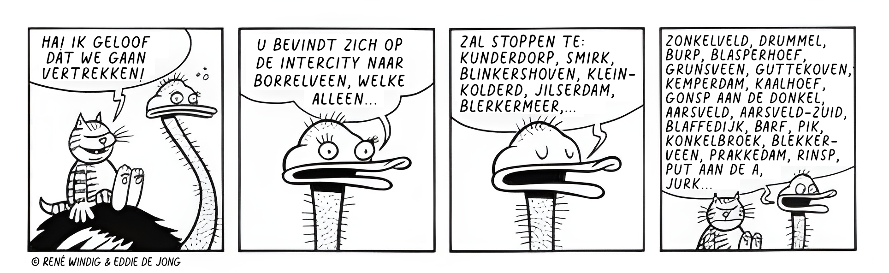

# Humorous Address Generator

This program generates funny Dutch postal addresses.
These can be used for fun or when anonymous data is needed.

It was inspired by the following
[Heinz](https://nl.wikipedia.org/wiki/Heinz_(strip))
cartoon:



## Usage

```sh
$ ./adres.pl [<count>]
```

Example:

```sh
$ ./adres.pl 2

Wilgenpark 73
7271 VQ Grebbenzeel
Merelhof 17
8702 ZB Heienveld
```

